# NextAdmin Dashboard (Learning Project)

This is a **Next.js admin dashboard project** created purely for learning purposes.

The main goal of this project was to understand:

- Next.js App Router
- Server Actions
- Authentication flow using NextAuth
- MongoDB integration
- Middleware protection
- Session handling (JWT vs Session)
- Protected routes (dashboard access control)

---

## 🚀 Purpose of this Project

This project is NOT focused on production deployment or responsive UI.

It was built to deeply understand how authentication and server-side logic works in Next.js.

---

## 🔐 Authentication Flow (What I Learned)

- User submits login form
- `useActionState` triggers `authenticate` server action
- `signIn("credentials")` is called
- NextAuth `authorize()` function runs
- Database is checked for user
- Password is compared using bcrypt
- If valid → JWT/session is created
- User is redirected to `/dashboard`

---

## 🧠 Key Concepts Implemented

- Server Actions (`app/lib/actions.js`)
- Credentials Provider (NextAuth)
- bcrypt password hashing
- MongoDB + Mongoose
- Middleware route protection
- JWT + Session callbacks
- Redirect handling after login

---

## 📸 Screenshots

### 🔑 Login Page
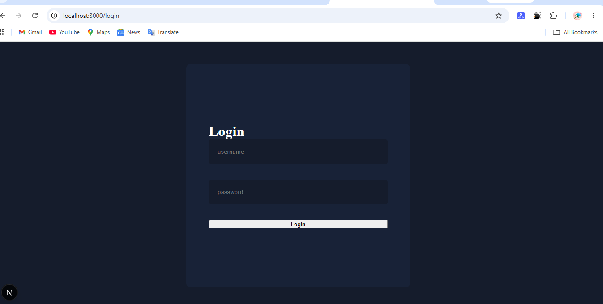

---

### 📊 Dashboard
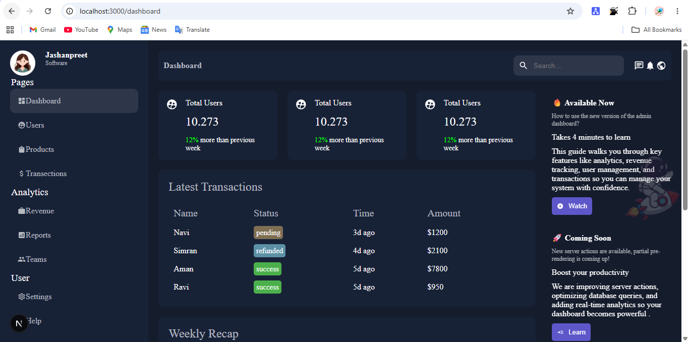

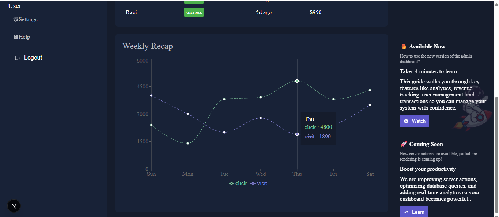

---

### 👤 Users Page
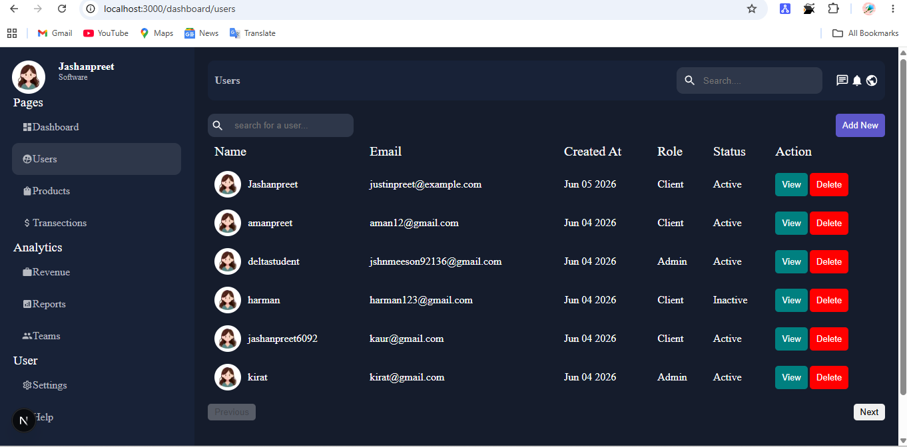

---

### 📦 Products Page
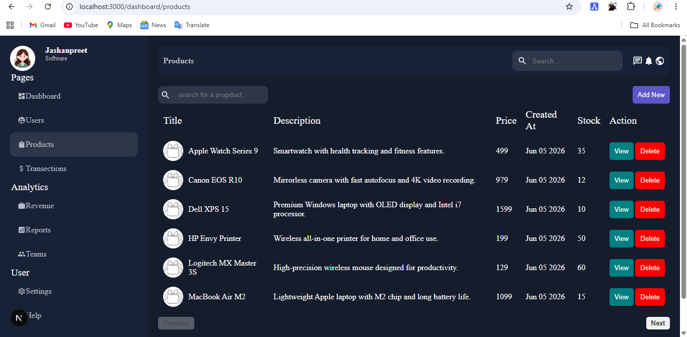

---

### 💰 Transactions Page
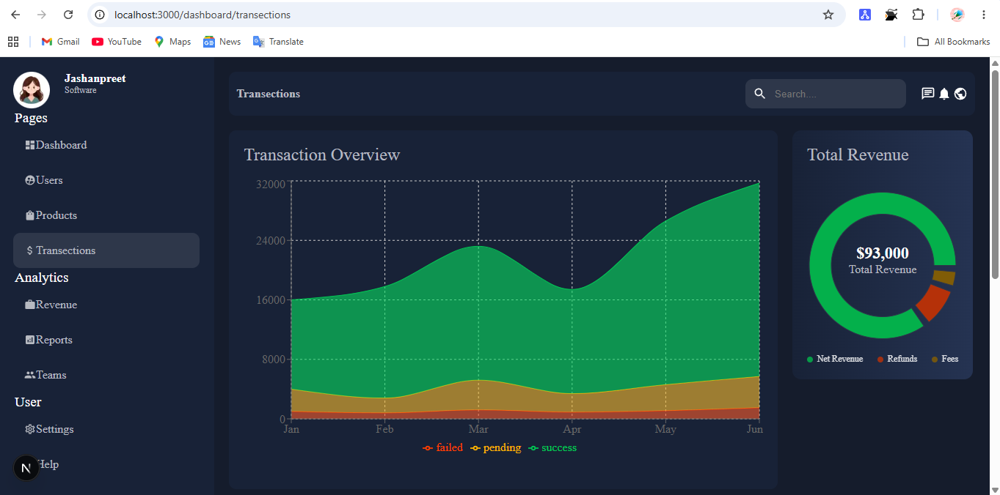

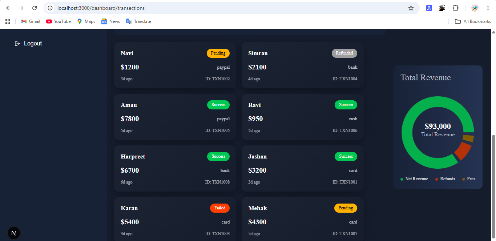

---

### 📈 Reports Page
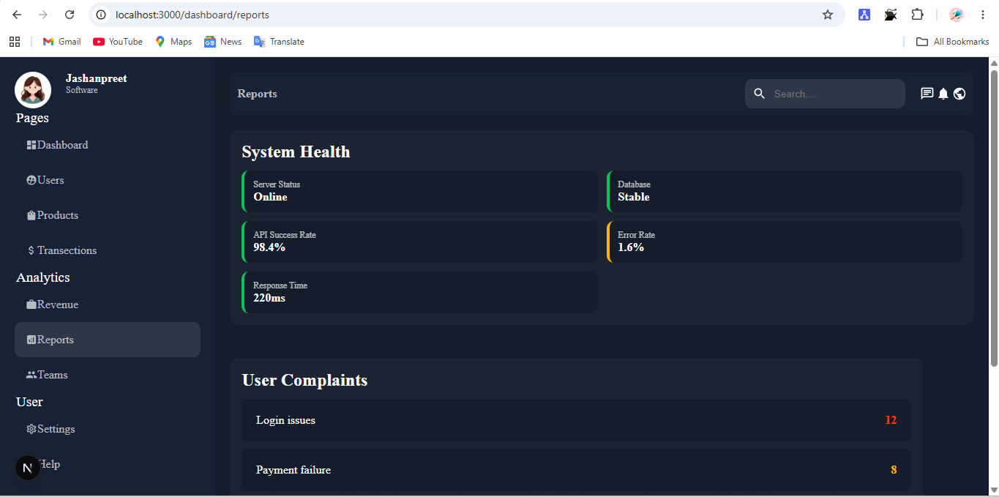

---

### 📊 Revenue Page
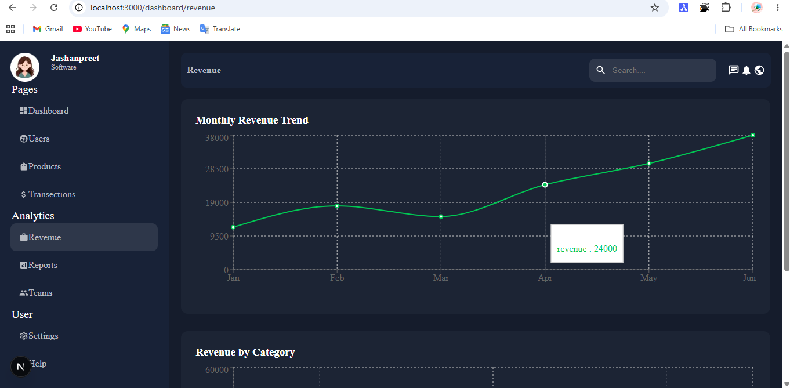

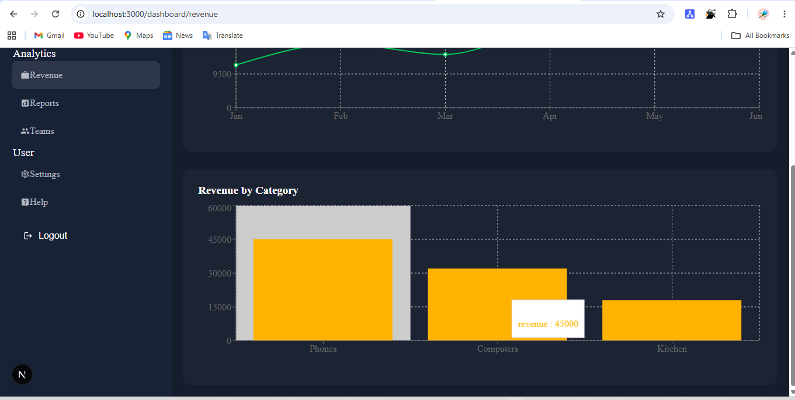

---

### 👥 Teams Page
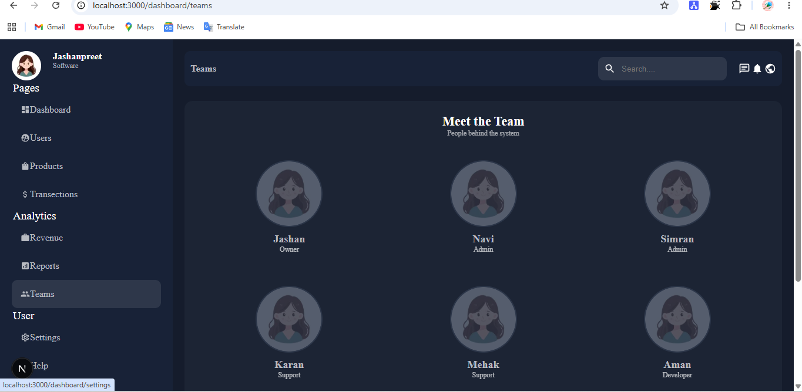

---

## 🗂 Project Structure
